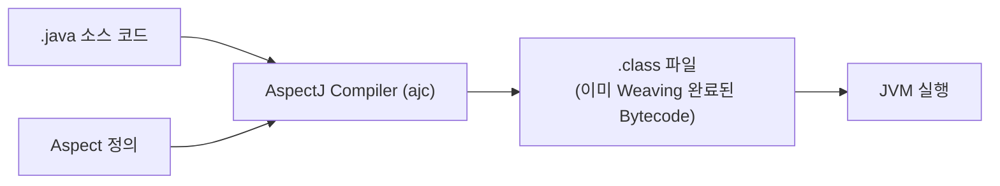
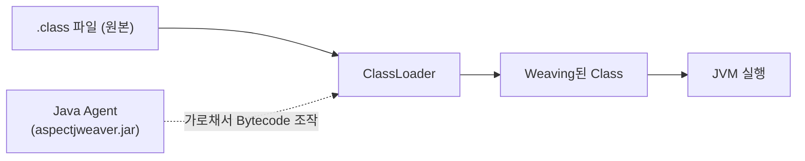
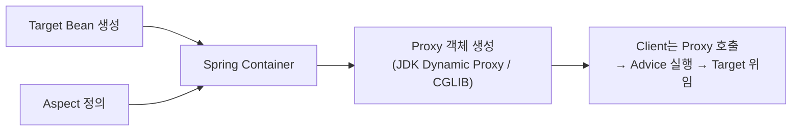

# AOP란?

AOP는 `Aspect Oriented Programming`의 약자로서, 한국어로 번역하면 `관점 지향 프로그래밍`이다.

## 관점 지향 프로그래밍?

사실 그냥 처음에 이 의미를 한국어로 본다고 해도, 직관적으로 와닿지 않는다. ~~(나도 마찬가지..)~~

### '관점'이 뭔데요?

그냥 관점이라고만 했을 땐, 도메인 관점? 뭐 비즈니스 관점? 뭐 이런건가.. 싶은데 `Spring Framework`의 AOP 문서를 보면 `crosscutting concerns`, 즉 `횡단 관심사`라는 이야기가 있다.

즉 AOP라는 것에서 다루는 "관점"이라는 것은 정확하게 표현하자면 **횡단** 관점 지향 프로그래밍이라고 생각하면 조금 더 쉽게 접근할 수 있다.

그렇다면 **횡단**이 있다면, **종단**도 있다는 것인데.. **종단**은 또 무엇인가? 쉽게 생각하면 우리가 일반적으로 개발을 할 때 보는 관점이라고 보면 된다.

정리해보면 아래와 같다.

| 용어 | 설명                                                   | 예시                  |
| ---- | ------------------------------------------------------ | --------------------- |
| 종단 | 개발할 때 일반적으로 생각하는 기능                     | 로그인, 회원가입 등   |
| 횡단 | 단일 로직뿐만이 아니라 시스템 전반적으로 사용하는 기능 | Logging, 인증/인가 등 |

즉, **관점 지향 프로그래밍**은 단일 로직에서만 쓰이지 않고, 시스템 여러 곳에서 사용해야 하는 기능을 모듈화해서 사용하는 방식이라고 생각하면 조금 더 이해가 쉽게 될 수 있다.

## AOP를 사용하기 전에 이해해야 하는 용어

Spring이 `Bean` 등 사용할 때 이해하고 있어야 하는 다양한 용어가 있는 것처럼, AOP도 그러한 용어들이 있다.

아래 표현은 Spring Framework의 Reference 문서에 정의된 AOP 용어들을 조금 더 쉽게 정리한 것이다.

### Aspect

관심사를 모듈화해둔 개념으로서, AOP가 언제, 어떤 것을 수행할 것인가를 정의하는 것이다.

### Target object

`Aspect`의 영향을 받는 `Object`를 의미한다.

### Join Point

프로그램이 실행될 때의 특정 시점을 의미함. (ex. Method 실행, Exception 처리 등). Spring AOP에서는 항상 Method 실행을 의미한다.

### Advice

특정 `Join Point`, 즉 Method 실행 시 `Aspect`가 수행할 동작을 의미하며, `Around`, `Before`, `After` 등의 유형이 존재한다.

### Pointcut

어느 `Join Point`에 실행할지에 대한 조건식으로, `Advice`는 이 `Pointcut`에 정의된 조건과 일치하는 `Join Point`에 실행하게 된다.

### Introduction

Class를 수정하지 않고도 새 Method나 Interface를 Runtime에 추가하는 기능으로서, 대상 Object가 특정 Interface를 구현한 것처럼 동작하게 할 수 있다.

`Introduction`은 `Advice`가 수행하는 동작을 정의하는 것과는 별개로 `Aspect` 내에서 정의하여 사용한다.

### AOP Proxy

AOP Framework에서 생성되는 Object로서, `Aspect` 규약을 실제로 구현하는데 사용된다.

Spring AOP에서는 `JDK Dynamic Proxy`나 `CGLIB Proxy`를 `AOP Proxy`로 사용한다.

### Weaving

`Aspect`와 `Target Object`를 연결하여, `Advice`가 적용된 `Object`를 만드는 과정을 의미한다.

즉, 실제로는 `Advice`와 `Target Object`의 `Method` (`Join Point`)가 따로따로 존재했지만, `Weaving` 과정이 그 둘을 결합해주는 것이다.

AOP Framework마다 Weaving 구현 방식이 다양한데, `AspectJ Compiler`를 이용하여 Compile Time에 수행하는 경우도 있고, Load Time 혹은 Runtime에서 수행하는 경우도 있다.

Spring AOP는 Runtime에 이 `Weaving`을 수행하도록 되어있다.

세 방식의 흐름을 비교해보면 아래와 같다.

**Compile Time Weaving (CTW)**



소스 컴파일 시점에 `ajc`가 `Aspect`를 `Target` 코드에 직접 짜 넣어서 `.class`를 만들어낸다. 실행 시점엔 이미 결합이 끝나 있어 별도 처리 비용이 없다.

**Load Time Weaving (LTW)**



`-javaagent:aspectjweaver.jar`로 등록된 Java Agent가 `ClassLoader`가 클래스를 로딩하는 시점을 가로채서 Bytecode를 그 자리에서 수정한다. 컴파일은 그대로 두고, 클래스 로딩 시점에 Weaving이 일어난다.

**Runtime Weaving (Spring AOP 방식)**



Bytecode 자체는 건드리지 않고, Bean 생성 시점에 원본을 감싸는 Proxy 객체를 대신 등록한다. Client는 항상 Proxy를 호출하게 되고, Proxy가 `Advice` 실행 후 원본 Target Method에 위임하는 방식으로 동작한다.

# Spring에서의 AOP
Spring AOP는 이러한 `관점 지향 프로그래밍`을 Spring Framework에서 보다 사용하기 쉽게 만들어주는 것이라고 보면 된다.

[AspectJ](https://eclipse.dev/aspectj/)라고 하는 Java에서의 AOP 구현체에서 사용하는 `Pointcut` 표현식 문법을 차용하고, Spring 자체 Proxy를 통해 Weaving 처리를 구현하는 방식으로 구성되어 있다.

`AspectJ`를 직접 사용하는 것도 가능하지만, 직접 사용하기 위해서 별도로 `AspectJ Compiler`를 사용하거나 혹은 `Aspect Weaver`라고 하는, Class Bytecode를 가로채서 수정할 수 있도록 하는 Java Agent를 등록해줘야 해서 프로젝트 설정이 복잡해지고 무거워진다.

Spring AOP의 경우에는 위의 복잡한 방법 대신, Runtime에서 Bean 생성 시점에 Proxy 객체를 대체하도록 하는 방식을 사용하여 위와 같이 별도 설정 없이 사용할 수 있다.

물론 AOP 기능을 더 자유롭게 사용하려면 `AspectJ`를 직접 사용하도록 세팅해야 하나, 일반적인 실무 레벨에서 AOP를 활용할 때에는 Spring AOP면 충분하다.

그럼 이제 어떻게 사용하는지 알아보자.

## 종속성 추가
Spring Boot를 사용하는 경우, [AOP Spring Boot Starter](https://mvnrepository.com/artifact/org.springframework.boot/spring-boot-starter-aop)가 제공되기 때문에 `build.gradle`이나 `pom.xml`에 이 AOP Starter를 넣으면 바로 쓸 수 있다.

나는 Spring Boot 4, Gradle을 사용하므로 아래처럼 AOP Starter를 추가해주었다.

```groovy
dependencies {
    implementation 'org.springframework.boot:spring-boot-starter-webmvc'
    implementation 'org.springframework.boot:spring-boot-starter-aop' // AOP Starter
....
```

## Aspect 정의

먼저 `Aspect`로 동작할 Class를 하나 만들고, `@Aspect`와 `@Component`를 붙여 Spring Bean으로 등록한다. `@Component`를 빼먹으면 Spring Container가 이 Class를 인식하지 못해 Weaving 대상에서 제외되니 주의해야 한다.

```java
package me.aftermoon.aspect;

import org.aspectj.lang.ProceedingJoinPoint;
import org.aspectj.lang.annotation.Around;
import org.aspectj.lang.annotation.Aspect;
import org.aspectj.lang.annotation.Pointcut;
import org.springframework.stereotype.Component;

@Aspect
@Component
public class LoggingAspect {

    @Pointcut("execution(* me.aftermoon.service..*.*(..))")
    public void serviceLayer() {}

    @Around("serviceLayer()")
    public Object logExecutionTime(ProceedingJoinPoint joinPoint) throws Throwable {
        long start = System.currentTimeMillis();

        Object result = joinPoint.proceed(); // 실제 Target Method 실행

        long elapsed = System.currentTimeMillis() - start;
        System.out.printf("[%s] 실행 시간: %dms%n", joinPoint.getSignature(), elapsed);

        return result;
    }
}
```

`joinPoint.proceed()`는 실제 Target Object의 Method를 호출하는 부분으로, `@Around`에서는 이 호출을 감싸서 실행 전/후에 원하는 로직(여기서는 실행 시간 측정)을 끼워넣을 수 있다.

### Advice 종류

`@Around` 외에도 아래와 같은 `Advice` 유형이 존재한다.

| Annotation | 실행 시점 | 특징 |
| --- | --- | --- |
| `@Around` | Target Method 실행 전체를 감쌈 | 실행 여부/반환값/예외를 모두 직접 제어 가능, 가장 강력하지만 그만큼 구현 부담도 큼 |
| `@Before` | Target Method 실행 전 | Method 실행 자체를 막을 순 없음(예외를 던지는 방식으로만 중단 가능) |
| `@AfterReturning` | Target Method가 정상적으로 리턴된 후 | 반환값(`returning`)에 접근 가능, 예외 발생 시엔 실행 안 됨 |
| `@AfterThrowing` | Target Method 실행 중 예외가 발생했을 때 | 발생한 예외(`throwing`)에 접근 가능 |
| `@After` | Target Method 종료 후 (정상/예외 무관) | `finally`와 동일한 성격, 항상 실행됨 |

위의 `@Around` 예제와는 별개로, 같은 `Pointcut`에 대해 나머지 `Advice` 유형만 모아서 보여주면 아래와 같다. (실제 프로젝트라면 하나의 `Aspect` Class에 한 종류의 `Advice`만 두거나, 용도별로 나누는 게 일반적이다.)

```java
package me.aftermoon.aspect;

import org.aspectj.lang.JoinPoint;
import org.aspectj.lang.annotation.After;
import org.aspectj.lang.annotation.AfterReturning;
import org.aspectj.lang.annotation.AfterThrowing;
import org.aspectj.lang.annotation.Aspect;
import org.aspectj.lang.annotation.Before;
import org.aspectj.lang.annotation.Pointcut;
import org.springframework.stereotype.Component;

@Aspect
@Component
public class ServiceLoggingAspect {

    @Pointcut("execution(* me.aftermoon.service..*.*(..))")
    public void serviceLayer() {}

    @Before("serviceLayer()")
    public void logBefore(JoinPoint joinPoint) {
        System.out.println("실행 전: " + joinPoint.getSignature());
    }

    @AfterReturning(pointcut = "serviceLayer()", returning = "result")
    public void logAfterReturning(JoinPoint joinPoint, Object result) {
        System.out.println("정상 종료, 반환값: " + result);
    }

    @AfterThrowing(pointcut = "serviceLayer()", throwing = "ex")
    public void logAfterThrowing(JoinPoint joinPoint, Exception ex) {
        System.out.println("예외 발생: " + ex.getMessage());
    }

    @After("serviceLayer()")
    public void logAfter(JoinPoint joinPoint) {
        System.out.println("Method 종료 (정상/예외 무관)");
    }
}
```

실무에서는 `@Around` 하나로 실행 시간 측정, 예외 로깅, 반환값 가공까지 한 번에 처리하는 경우가 많지만, 각 시점별로 역할을 명확히 나누고 싶다면 `@Before`/`@AfterReturning`/`@AfterThrowing`/`@After`를 따로 쓰는 게 코드 의도를 더 분명하게 드러낼 수 있다.

## Pointcut 사용

위에서 사용한 `execution(* me.aftermoon.service..*.*(..))`가 바로 `Pointcut` 표현식이다.

- 첫 번째 `*` : 반환 타입 (모든 타입 허용)
- `me.aftermoon.service..*` : `service` 패키지 및 하위 패키지의 모든 Class
- 두 번째 `*(..)` : 모든 Method 이름, 모든 파라미터 허용

즉 `me.aftermoon.service` 이하 모든 Class의 모든 Method가 이 `Pointcut`에 매칭되어 `Advice`(`logExecutionTime`)가 적용된다.

실제로 아래와 같은 Service가 있다면,

```java
package me.aftermoon.service;

import org.springframework.stereotype.Service;

@Service
public class MemberService {

    public String findMember(Long id) {
        return "member-" + id;
    }
}
```

`memberService.findMember(1L)`을 호출하는 순간, 실제로는 Spring이 Runtime에 생성한 Proxy 객체가 대신 호출을 받아 `LoggingAspect.logExecutionTime()`을 먼저 실행하고, 그 안에서 `joinPoint.proceed()`를 통해 원본 `findMember()`를 호출하는 흐름으로 동작한다.

`Pointcut`을 특정 Method 이름 패턴이 아닌, Annotation 기반으로 지정하는 것도 가능하다. 직접 만든 Annotation을 기준으로 Pointcut을 잡으면 아래처럼 된다.

```java
@Retention(RetentionPolicy.RUNTIME)
@Target(ElementType.METHOD)
public @interface LogExecutionTime {
}
```

```java
@Pointcut("@annotation(me.aftermoon.aspect.LogExecutionTime)")
public void logExecutionTimeAnnotation() {}
```

이렇게 하면 `execution` 표현식처럼 패키지/클래스 구조에 의존하지 않고, `@LogExecutionTime`이 붙은 Method에만 정확히 `Advice`를 적용할 수 있어 뒤에서 다룰 "로직이 어디 있는지 찾기 어렵다"는 단점을 어느 정도 보완할 수 있다.

### Pointcut 지정자 종류

Spring AOP에서 사용 가능한 `Pointcut 지정자`는 아래와 같다.

| 지정자 | 설명 | 예시 |
| --- | --- | --- |
| `execution` | Method 실행 Join Point를 매칭. 가장 많이 사용 | `execution(* me.aftermoon.service..*.*(..))` |
| `within` | 특정 타입(패키지/클래스) 내 Join Point로 제한 | `within(me.aftermoon.service.*)` |
| `this` | Proxy 객체가 특정 타입인 경우 매칭 | `this(me.aftermoon.service.MemberService)` |
| `target` | Target Object가 특정 타입인 경우 매칭 | `target(me.aftermoon.service.MemberService)` |
| `args` | Method 파라미터 타입이 조건과 일치할 때 매칭 | `args(java.lang.Long)` |
| `@target` | Target Object의 Class에 특정 Annotation이 붙어있을 때 매칭 | `@target(org.springframework.stereotype.Service)` |
| `@within` | 특정 Annotation이 붙은 타입 내 Join Point로 제한 | `@within(org.springframework.stereotype.Service)` |
| `@annotation` | 실행되는 Method 자체에 특정 Annotation이 붙어있을 때 매칭 | `@annotation(me.aftermoon.aspect.LogExecutionTime)` |
| `@args` | 전달된 파라미터의 실제 타입에 특정 Annotation이 붙어있을 때 매칭 | `@args(me.aftermoon.dto.Validated)` |
| `bean` | Spring Bean 이름(또는 패턴)으로 매칭 | `bean(*Service)` |

각각 예시로 좀 더 풀어보면 아래와 같다.

```java
// execution: service 패키지 하위, 이름이 find로 시작하는 모든 Method
@Pointcut("execution(* me.aftermoon.service..*.find*(..))")
public void findMethods() {}

// within: repository 패키지 전체
@Pointcut("within(me.aftermoon.repository..*)")
public void repositoryLayer() {}

// args: 파라미터로 Long 하나만 받는 Method
@Pointcut("args(java.lang.Long)")
public void singleLongArgMethods() {}

// @annotation: @Transactional이 붙은 Method
@Pointcut("@annotation(org.springframework.transaction.annotation.Transactional)")
public void transactionalMethods() {}

// bean: Bean 이름이 Service로 끝나는 모든 Bean
@Pointcut("bean(*Service)")
public void serviceBeans() {}
```

여러 `Pointcut`을 `&&`, `||`, `!` 로 조합하는 것도 가능하다.

```java
@Pointcut("execution(* me.aftermoon.service..*.*(..)) && args(java.lang.Long)")
public void serviceMethodsWithLongArg() {}
```

위 예시는 `service` 패키지 이하 Method 중에서, 파라미터로 `Long` 하나만 받는 Method에만 매칭되는 `Pointcut`이다.

# AOP 사용의 단점

이렇게만 봤을 때, AOP는 Logging, 인증/인가와 같은 내용들을 중복하여 쓰지 않고, 재활용할 수 있어서 매우 좋아보이고 안 쓸 이유가 없어보인다.

하지만, 개발에서 완벽한 것은 없듯이 AOP도 단점이 존재한다.

## 1. 분명히 로직은 동작하는데, 이게 어디 작성되어 있는거지?

실제로 내가 처음 인가 처리를 AOP를 사용하여 수행하는 프로젝트의 코드를 봤을 때 실제로 겪었던 문제인데, 대체 이 로직이 어딨는지 한 눈에 확인하기 어렵다는 것이다.

위의 표현을 다시 한 번 빌려, 일반적인 **종단** 방식으로 개발을 했을 때에는, 코드 추적을 할 때 IDE에서 해당 메소드를 눌러서 어디서 온 메소드인지 확인하는 등 추적하기가 매우 쉽지만 AOP처럼 **횡단** 형태로 되어있는 경우 이런 자동 찾기를 활용하기 어렵다.

물론 Annotation을 기반으로 하는 경우에는 그나마 `Pointcut` 표현식에 선언을 해두어서 찾기 편하겠지만.. Method나 Bean을 실행 조건으로 쓰면 AOP를 모를 경우 찾는데 오래걸릴 것이다.

## 2. 왜 같은 클래스 내에서 호출하면 AOP 로직이 동작하지 않지?

이를 `Self-Invocation`이라고 부르는데, Spring AOP는 Proxy 기반으로 동작하기 때문에 외부에서 Proxy 객체를 거쳐 Method를 호출해야만 `Advice`가 적용된다. 대표적으로 `@Transactional`도 내부적으로 AOP(Proxy)로 구현되어 있어서 이 문제를 그대로 겪는다.

```java
package me.aftermoon.service;

import org.springframework.stereotype.Service;
import org.springframework.transaction.annotation.Transactional;

@Service
public class MemberService {

    public void outer() {
        inner(); // Proxy를 거치지 않은 this.inner() 호출
    }

    @Transactional
    public void inner() {
        // 여기서 예외가 나도 Transaction Rollback이 걸리지 않는다
    }
}
```

`outer()`를 밖에서 호출하면 `outer()` 자체에는 `@Transactional`이 없으니 그대로 실행되고, 그 안에서 `inner()`를 호출하는 부분은 `this.inner()`, 즉 Proxy가 아닌 원본 객체를 통한 직접 호출이라 `@Transactional`을 처리하는 `TransactionInterceptor`(`Advice`)가 끼어들 틈이 없다. 결과적으로 Transaction이 전혀 시작되지 않은 채로 `inner()`가 실행되고, Method 안에서 예외가 발생해도 Rollback되지 않는다.

Proxy 객체를 거쳐야 Advice가 끼어들 수 있는데, 같은 클래스 내부 호출은 그냥 그 안에서 호출을 하다보니 Proxy 객체가 끼어들지 못하고 바로 실행되어버리기 때문이다.

이 문제를 피하려면 아래 방법 중 하나를 선택해야 한다. 

1. **Method를 다른 Class로 분리**: `inner()`를 별도의 Bean(Class)으로 옮기고, `MemberService`가 그 Bean을 주입받아 호출하도록 구조를 바꾼다. 가장 권장되는 방법.

2. **자기 자신을 주입받아 호출**: `ApplicationContext` 혹은 자기 자신 Bean을 주입받아, `this.inner()`가 아니라 `주입받은 Proxy.inner()`로 호출한다. 다만 이 방법은 너무 많이 사용하면 코드가 복잡해질 수 있어서 개인적으로는 선호하지 않는다.

```java
package me.aftermoon.service;

import org.springframework.context.annotation.Lazy;
import org.springframework.stereotype.Service;
import org.springframework.transaction.annotation.Transactional;

@Service
public class MemberService {

    private final MemberService self;

    public MemberService(@Lazy MemberService self) {
        this.self = self;
    }

    public void outer() {
        self.inner(); // Proxy를 거쳐서 호출됨
    }

    @Transactional
    public void inner() {
        // 이제 Transaction 정상 적용
    }
}
```

3. **`AopContext.currentProxy()` 사용**: `@EnableAspectJAutoProxy(exposeProxy = true)` 설정 후, Method 내부에서 `((MemberService) AopContext.currentProxy()).inner()`로 직접 현재 Proxy를 꺼내 호출한다. 다만 AOP 구현에 강하게 결합되는 방식이고, 2번보다 코드가 더 복잡해지는 문제가 생기기 때문에 권장되지 않는다.

## 3. 성능 이슈

위에서 얘기했던 것처럼, Spring AOP는 Spring 자체 Proxy 기반으로 `Target Object`가 실제로 수행될 때 Runtime에 연결하는 방식으로 구현되어 있다.

그렇기에 만약 Method 하나에 여러 개의 `Aspect`가 연결된다면, 그만큼 Proxy를 거치는 단계도 늘어나 Call Overhead가 누적된다. Method 실행 한 번에 여러 `Advice`가 순차적으로 감싸지는 구조라, `Aspect`가 많아질수록 순수 Method 호출 대비 지연이 커질 수밖에 없다.

만약 `Aspect`가 너무 많아져서 성능에 지연이 심해지면, Spring AOP 대신 `AspectJ`를 직접 사용하여 Compile Time 혹은 Load Time에서 `Aspect`를 사용하는 방식으로 변경하는 것을 고려할 필요가 있다.

# References

- [Aspect Oriented Programming with Spring](https://docs.spring.io/spring-framework/reference/core/aop.html)
- [AOP Concepts](https://docs.spring.io/spring-framework/reference/core/aop/introduction-defn.html)
- [Spring Boot2에서 AspectJ 위빙으로 바꿔볼까?](https://gmoon92.github.io/spring/aop/2019/05/24/aspectj-of-spring.html)
