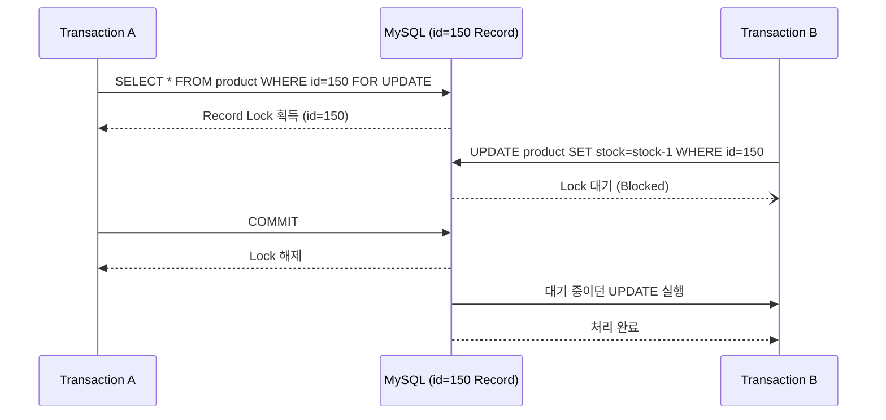
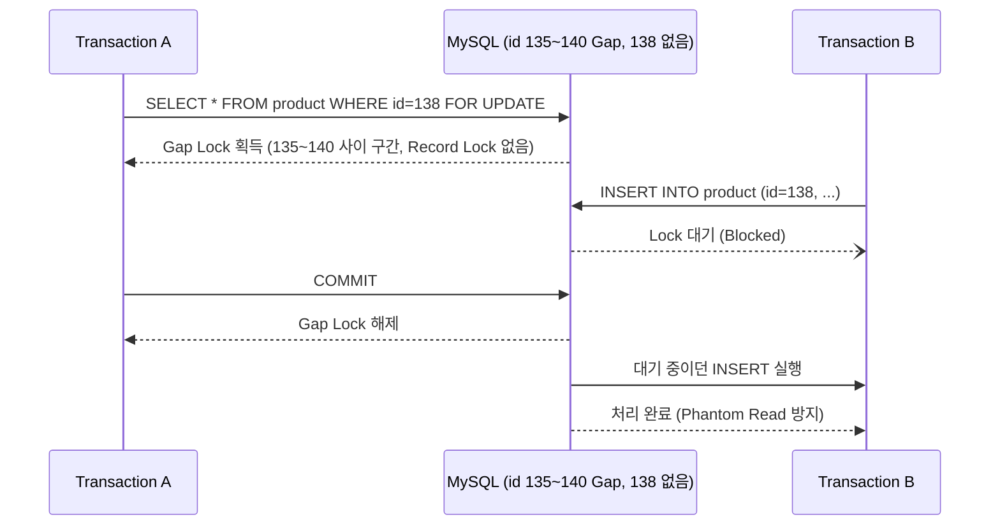
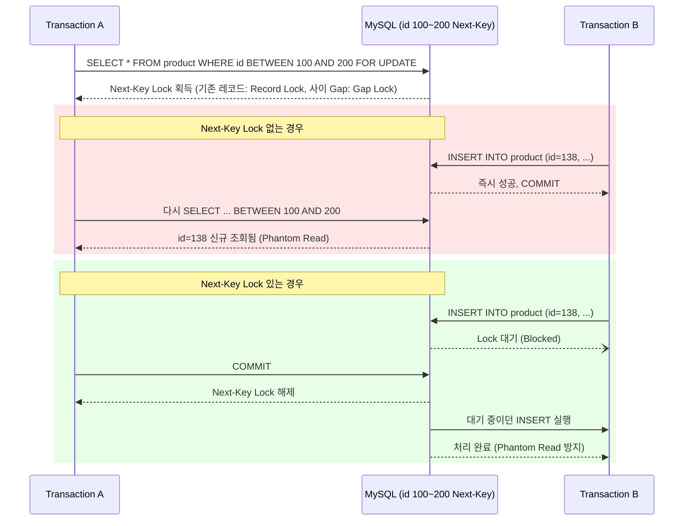
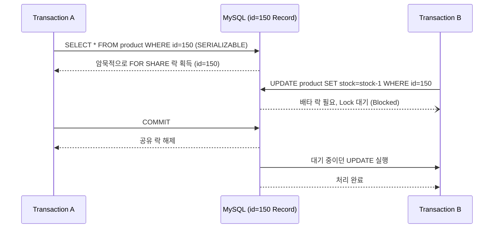

# 트랜잭션 (Transaction)이란?
**트랜잭션 (Transaction)**은 `Commit` 혹은 `Rollback` 될 수 있는 원자적인 작업 단위를 의미한다.

트랜잭션이 데이터베이스에 여러 명령들을 통해 변경 사항을 수행할 때, `Commit` 되면 트랜잭션 내 작성한 명령에 따른 변경 사항이 데이터베이스에 반영되고, `Rollback` 되면 모든 변경사항이 취소된다.

MySQL에서 기본적으로 사용하는 데이터베이스 엔진인 `InnoDB`에서는 트랜잭션은 `ACID`라는 원칙을 따르고 있다.

# ACID란?
**ACID**는 트랜잭션이 가져야 할 4가지 원칙의 앞 글자를 따서 부르는 명칭이다.

각 글자마다 아래와 같은 의미를 담고 있다.
- **A**tomicity (원자성)
- **C**onsistency (일관성)
- **I**solation (격리성) 
- **D**urability (지속성)

## Atomicity (원자성)
트랜잭션으로 묶인 작업들이 부분적으로 실행되거나, 중단되는 것이 아닌 모두 한 번에 실행 혹은 중단되어야 한다는 원칙이다.

한 번에 이해가 안 될 수 있는데, 비유를 해보자면 트랜잭션은 한 척의 배와 같고, 각 명령어 (Query)들은 그 배에 탄 사람들과 같다. 

도착지를 데이터베이스라고 보면, 하나의 배에 같이 탄 명령어 (Query)들은 무조건 도착지 (데이터베이스)에 다 같이 도착해서 도착지에 내리거나, 혹은 배가 도착하지 않고 원래 있던 곳으로 돌아가서 도착지 (데이터베이스)는 아무 일이 없게 되는 것이다.

이를 데이터베이스에서 사용하는 용어로 바꾸면
- 트랜잭션에 속한 CRUD와 같은 작업들을 하나의 단위로 취급하여 모든 작업들을 한 번에 실행하거나, 혹은 아예 실행하지 않아야하는게 원칙이다. 
- 이 원칙으로 인해 하나의 작업이 도중에 실패하면, 트랜잭션 내 작업 전체가 Rollback 되는 것이다.

`InnoDB`는 이 원칙을 **Undo Log**를 통해 구현한다.

- 트랜잭션 안에서 `INSERT`, `UPDATE`, `DELETE`처럼 데이터를 변경하는 명령을 실행할 때마다, `InnoDB`는 그 변경을 되돌릴 수 있는 정보를 `Undo Log`에 함께 기록해둔다.
- `Rollback`이 호출되면, `InnoDB`는 이 `Undo Log`를 역순으로 읽으면서 트랜잭션이 시작된 이후 실행한 변경사항들을 하나씩 되돌린다.
- 반대로 `Commit`이 되면 그 `Undo Log`는 더 이상 필요 없어져서 (다른 트랜잭션이 참조 중이 아니라면) 정리 대상이 된다.

## Consistency (일관성)
트랜잭션이 끝나도 (`Commit`, `Rollback` 둘 다), 데이터베이스가 정해진 규칙을 일관성있게 지켜 데이터베이스의 상태를 정상적으로 계속 유지해야 한다는 원칙이다.

- DB 제약조건을 깨는 예시
    - UNIQUE 속성을 걸어둔 컬럼에 기존에 있었던 값을 또 넣으려고 하는 경우
    - Foreign Key 컬럼인데 실제로 존재하지 않는 Key 값을 넣으려고 하는 경우

- 비즈니스 규약을 깨는 예시
    - 쇼핑몰에서 구매 처리 하는 트랜잭션에서는 현재 상품 재고에서 -1를 해야하는데, 재고 자체가 없는 (0)인 경우
    - 은행에서 계좌 간 송금 처리하는 트랜잭션에서 보내는 쪽 계좌 금액이 10,000원인데 20,000원을 송금하려고 하는 경우

위와 같이 DB 제약조건 혹은 정해진 비즈니스 규약들을 깨는 명령이 트랜잭션에 속해 있다면, 트랜잭션을 `Rollback`을 해서 원래 상태로 돌려놔야 한다. 

이 때 오해할 수 있는건, `Rollback`은 이러한 오류가 있다고 알아서 수행되지 않고, 명시적으로 처리해주어야 한다.

프레임워크를 사용해서 애플리케이션 개발 시에는 이를 명시적으로 처리하지 않아도 자동으로 `Rollback`되는데, 이것은 위의 명시적 처리를 프레임워크가 대신 하기 때문이다.

예를 들어, Spring Boot + JPA 애플리케이션인 경우, `@Transactional` Annotation을 걸어둔 메소드에서 DB 일관성 에러 or 비즈니스 규약 에러로 인해 Exception이 발생하면 자동으로 `Rollback` 처리하도록 되어있다.

당연히 `Rollback`을 했을 때도, 데이터베이스에는 아무 영향 없이 그대로 기존의 상태를 유지하도록 일관성을 유지해야 한다.

## Isolation (격리성) 
일반적인 애플리케이션은 트랜잭션이 같은 순간에 한 번만 일어나지 않고 여러 트랜잭션이 동시에 실행된다.

이 때 같은 데이터에 대해서 수정을 가하게 되면, 당연히 트랜잭션 별로 서로 생각했던 결과와 다르게 데이터베이스에 반영될 가능성이 매우 높아진다.

그렇기에 서로 다른 트랜잭션은 격리되어 실행되어야 한다는 원칙이다.

이 때 트랜잭션의 격리는 `트랜잭션 격리 레벨 (Transaction Isolation Level)`이라고 하는, 격리 레벨 설정을 통해 어느 Level까지 격리하게 할지 Level을 설정할 수 있게 되어있다.
- 이는 '격리'라는 자체를 완벽하게 수행하려면 일반적으로 실행하는 것보다 추가로 처리해야 하는 부분이 많아져 성능이 저하되거나, 혹은 다른 트랜잭션이 아예 건드릴 수 없게 막는 Lock이 걸려버려서 동시에 처리하는 능력이 떨어지게 된다.
- 그렇기에 항상 모든 명령이 강한 격리가 필요하지 않을 수도 있기 때문에 개발자가 비즈니스 요구사항에 따라서 trade-off를 고려해 설정할 수 있게 하기 위함이라고 보면 된다.

### 트랜잭션 격리 레벨 (Transaction Isolation Level)
여러 트랜잭션이 수행되는 환경에서 성능 및 데이터 정합성 및 신뢰성 간의 균형을 설정하기 위한 기준이다. 

위에서 얘기했던 것처럼 상황에 따라 격리의 강도를 개발자가 적절히 조절하여 사용할 수 있게 나눠둔 것이라고 보면 된다.

이 격리 레벨을 어떻게 설정하냐에 따라서, 각 트랜잭션의 실행 결과가 달라질 수 있다.

MySQL에서 기본으로 사용하는 데이터베이스 엔진인 `InnoDB`에서는 [SQL-92](https://www.iso.org/standard/16663.html) 표준에 정의된 4가지 Level을 지원한다.

- READ UNCOMMITTED
- READ COMMITTED
- **REPEATABLE READ (InnoDB Default)**
- SERIALIZABLE 

위에서 아래로 내려갈 수록 격리의 강도가 높아진다.

참고로 격리에서 가장 핵심적인 개념은 **Lock (잠금)** 이라는 개념인데, 이에 대해서는 각 Level에 대해서 설명하면서 같이 다룰 것이다.

또 각 격리 Level에서 Lock을 어떻게 거냐에 따라서 **Dirty Read**, **Non-Repeatable Read**, **Phantom Read**라는 읽기 문제도 발생하는데, 이 또한 아래에서 같이 설명할 것이다.

#### READ UNCOMMITTED
가장 약한 격리 Level으로서, 다른 트랜잭션에서  `Commit`하지 않은 변경 사항도 즉시 읽을 수 있는 상태이다.

위에서 들었던 설명만 봤을 때에는 "엥? 그럼 이건 그냥 격리성을 포기하는거 아니야?" 라고 생각이 든다.

하지만 이게 존재하는 이유는 위에서 얘기했던 것처럼 "격리"라는 것이 동시성과 성능에 제약을 주기 때문에, 격리 필요 없이 빠르게 현재 데이터를 읽기만 하면 되는 경우를 위해 존재한다.

MySQL의 `Transaction Isolation Levels` 문서 설명에도 아래처럼 나와있다.

```text
you can relax the consistency rules with READ COMMITTED or even READ UNCOMMITTED, in situations such as bulk reporting where precise consistency and repeatable results are less important than minimizing the amount of overhead for locking.
```

이를 한국어로 번역하면 아래와 같다.

```text
대량 리포팅과 같이 정확한 일관성과 반복 가능한 결과보다 잠금에 따른 오버헤드를 최소화하는 것이 더 중요한 상황에서는 READ COMMITTED나 혹은 READ UNCOMMITTED를 사용해서 일관성 규칙을 완화할 수 있다.
``` 

즉, 대량으로 빠르게 현재 데이터를 수집하여 보여주어야 하는 경우와 같은 작업 (MySQL 문서에서 얘기한 `대량 리포팅` 등)을 하는 경우  일관성이나 반복 가능한 결과가 그다지 중요하지 않기 때문에 격리의 필요성이 떨어지기 때문에, 격리를 사실상 꺼버리는 트랜잭션이라고 보면 된다.

이 Level을 사용했을 때에는 격리를 아예 꺼버리기 때문에, **Dirty Read**라고 부르는 문제가 발생하게 된다.
- **Dirty Read**: 현재 수행하고 있는 트랜잭션이 아닌 다른 트랜잭션에서 데이터가 업데이트 되었지만 아직 `Commit`되지 않아 신뢰할 수 없는 데이터를 가져오게 되는 현상. 다른 트랜잭션이 `Rollback` 되는 경우 읽어온 데이터가 존재하지 않는 문제가 발생할 수 있다.

#### READ COMMITTED
`Commit`된 데이터만 조회하는 격리 Level이다.

`READ UNCOMMITTED`이 다른 트랜잭션의 `Commit`되지 않은 변경사항까지 보여줘서 **Dirty Read** 문제가 있었다면, READ COMMITTED는 이름 그대로 `Commit`된 데이터만 보여주도록 해서 이 문제를 해결한 격리 Level이다.

즉, 다른 트랜잭션에서 아직 `Commit`하지 않은 변경사항은 보이지 않고, 오직 `Commit`이 완료된 데이터만 조회 가능하다

`SELECT` Query를 할 때마다 매 번 새로운 Snapshot을 생성하고 Lock을 걸지 않기 때문에 **일관성 있는 비 잠금 읽기 (Consistent Nonlocking Read)** 방식으로 조회된다.

이렇게 Lock 없이도 일관된 Snapshot을 읽을 수 있는 이유는 `InnoDB`가 **MVCC (Multi-Version Concurrency Control)** 방식을 사용하기 때문이다.
- `UPDATE`나 `DELETE`로 레코드가 변경되면, `InnoDB`는 그 이전 버전의 데이터를 `Undo Log`에 별도로 보관해둔다.
- `SELECT`를 실행하는 시점에 `Read View` (현재 조회 가능한 버전 목록)를 생성하고, 이 `Read View` 기준으로 봤을 때 아직 `Commit`되지 않았거나 조회 시점 이후에 변경된 데이터는 `Undo Log`에 있는 이전 버전을 대신 읽어온다.
- 이 덕분에 다른 트랜잭션이 데이터를 변경 중이더라도 Lock을 걸어 막을 필요 없이, 각자 자신의 시점에 맞는 버전을 읽어갈 수 있는 것이다.
- READ COMMITTED는 `SELECT`할 때마다 매번 새로운 `Read View`를 생성하기 때문에, 같은 트랜잭션 안에서도 매 조회 시점의 최신 `Commit`된 데이터를 보게 된다.

FK 제약 조건 검사나 중복 Key 검사를 제외하고, Lock을 걸고 조회 (`SELECT ... FOR UPDATE`, `SELECT ... FOR SHARE`), `UPDATE`, `DELETE` 수행 시에도 `Record Lock`만 사용하고 `Gap Lock`은 사용하지 않는다.

이 Level을 사용했을 때에는 매 번 `SELECT`할 때마다 새로운 Snapshot을 만들기 때문에, 다른 트랜잭션이 `SELECT`에서 조회했던 데이터를 수정하고 `Commit`하면, 새로 변경된 사항을 읽어오게 되어 **Non-Repeatable Read**라고 부르는 문제가 발생하게 된다.
- **Non-Repeatable Read**: 같은 트랜잭션 내에서 동일한 `SELECT` Query를 두 번 이상 수행했을 때, 그 사이에 다른 트랜잭션이 해당 데이터를 수정하고 `Commit`하여 두 조회 결과가 서로 다르게 나오는 현상.

또한 위에서 언급한 것처럼 FK 제약 조건 검사나 중복 Key 검사를 제외하고는 `Gap Lock`을 사용하지 않기 때문에, 다른 트랜잭션이 조회 범위 사이에 새로운 레코드를 `INSERT`하고 `Commit`하는 것을 막지 못한다. 그래서 READ COMMITTED에서도 **Phantom Read**라고 부르는 문제가 발생한다.
- **Phantom Read**: 같은 트랜잭션 내에서 동일한 조건의 범위 조회 (`BETWEEN`, `WHERE ... >` 등)를 두 번 이상 수행했을 때, 그 사이에 다른 트랜잭션이 그 범위에 해당하는 레코드를 `INSERT`하고 `Commit`하여, 이전에는 없었던 데이터가 이후 조회에서 갑자기 나타나는 현상.

##### Record Lock
- **Record Lock**: 조회한 그 데이터 레코드에 대한 잠금을 걸어 다른 트랜잭션으로부터 레코드가 변경되는 것을 막는 것
    - Query가 조회한 데이터 레코드의 Index에 대해서 개별적으로 잠금이 걸린다.
        - Lock을 걸고 조회 (`SELECT ... FOR UPDATE`, `SELECT ... FOR SHARE`)하거나 `INSERT`, `UPDATE`, `DELETE`를 수행할 때만 `Record Lock`이 걸린다.
        - 일반 `SELECT`의 경우 Snapshot을 읽어오는 것이기 때문에 `Record Lock`을 걸지 않는다.
    - 주의해야 할 점은, Lock을 거는 대상은 조회 조건에 따라 조금씩 달라진다.
        - **PK**로만 조회한 경우에는 **PK** Index 레코드에 대해서 락이 걸린다.
        - 그 외 다른 Index (`UNIQUE` Column, 기타 보조 Index)로 조회하게 되면, 조회 시 사용한 해당 Index는 물론, **PK** Index 레코드도 락이 걸린다.
        - 만약 Index가 없는 컬럼으로만 조회하게 되면 `Full Table Scan`이 발생, 즉 테이블 전체를 스캔하게 되어 이 과정에서 스캔 테이블 내의 모든 PK 레코드 전체에 Lock이 걸리게 된다.



##### Semi-Consistent Read (Early Lock Release)
READ COMMITTED에서만 나타나는 특징으로, `UPDATE`가 보조 Index를 스캔하다가 이미 다른 트랜잭션이 `Record Lock`을 걸어놓은 레코드를 만났을 때 동작하는 방식이다.

- 원래대로라면 이 레코드에 락이 풀릴 때까지 무작정 대기해야 하지만, **Semi-Consistent Read**는 일단 대기하지 않고 그 레코드의 최신 `Commit`된 버전을 읽어와서 `UPDATE`의 `WHERE` 조건에 맞는지부터 확인한다.
- 확인해보니 `WHERE` 조건에 맞지 않는 레코드라면, 애초에 이 `UPDATE`가 손댈 필요가 없는 레코드였다는 뜻이므로 락을 걸지 않고 바로 다음 레코드로 넘어간다 (**Early Lock Release**). 불필요하게 락을 기다리거나 걸지 않아도 되니 그만큼 동시성이 좋아진다.
- 반대로 `WHERE` 조건에 맞는 레코드라면, 그 때부터는 정상적으로 락을 걸거나 (이미 다른 트랜잭션이 락을 걸고 있다면) 락이 풀릴 때까지 대기한다.

이 기능은 REPEATABLE READ에서는 적용되지 않는다. REPEATABLE READ는 Phantom Read를 막기 위해 `Gap Lock`까지 포함한 `Next-Key Lock`으로 범위 전체를 보호해야 하기 때문에, 이렇게 조건에 안 맞는 레코드를 미리 걸러내고 락을 풀어주는 최적화를 적용할 수 없다.

#### REPEATABLE READ (InnoDB Default)
`InnoDB`가 기본으로 사용하는 격리 Level으로 `READ COMMITTED`가 `SELECT`를 할 때마다 매 번 새로운 `Read View`를 생성하여 `Non-Repeatable Read`가 발생했다면, **REPEATABLE READ**는 트랜잭션 내 처음 조회하는 시점에 딱 한 번만 `Read View`를 생성하여 같은 트랜잭션 안에서는 계속 그 `Read View`를 사용한다.

그렇기에 트랜잭션을 수행하던 도중에 다른 트랜잭션이 데이터를 수정하고 `Commit`을 하더라도, 같은 `SELECT`를 수행하면 처음 만든 `Read View` 기준으로 데이터를 보여준다.
- 단, 같은 트랜잭션 내에서 변경된 내용이 있을 경우에는 해당 내용이 반영되어 보여진다.

`READ COMMITTED`는 FK 제약 조건 검사나 중복 Key 검사를 제외하고 `Gap Lock`을 사용하지 않아서 **Phantom Read**가 발생할 수 있었다면, **REPEATABLE READ**는 `Gap Lock`을 `Record Lock`과 결합한 **Next-Key Lock**을 사용해서 이 문제를 막는 격리 Level이다.

여기서 주의해야 할 점은, 지금까지 설명한 것처럼 트랜잭션 내내 하나의 `Read View`를 재사용하는 것은 잠금이 없는 일반 `SELECT`에만 해당된다는 것이다.

Lock을 걸고 조회 (`SELECT ... FOR UPDATE`, `SELECT ... FOR SHARE`)하거나, `UPDATE`, `DELETE`와 같이 데이터를 변경하는 명령은 트랜잭션 시작 시 만들어둔 `Read View`를 사용하지 않고, 항상 그 시점에 `Commit`되어 있는 최신 데이터를 기준으로 읽는다.
- 이는 잠금을 걸어 보호해야 할 데이터가 이미 오래된 Snapshot 기준이라면, 그 사이 다른 트랜잭션이 변경한 최신 상태와 어긋난 채로 락을 거는 꼴이 되어 의미가 없기 때문이다.
- 그래서 REPEATABLE READ에서도 잠금 읽기나 DML을 수행할 때는 최신 `Commit`된 데이터를 조회한 뒤, 그 데이터에 대해 아래에서 설명할 `Record Lock`, `Gap Lock`, `Next-Key Lock`을 거는 방식으로 동작한다.

이런 특징때문에, **REPEATABLE READ** Level을 사용하는 트랜잭션에서는 일반 `SELECT`와 Lock을 걸고 `SELECT`하는 것을 혼용해서 사용하게 되면 정합성에 문제가 발생할 수 있어 두 개를 혼용해서 사용하지 말 것을 권장하고 있다.

예를 들어, 사용자가 주문을 취소하는 API 요청을 처리하는 트랜잭션이 있다고 하자. 이 트랜잭션은 아래와 같은 순서로 동작한다고 가정한다.

1. 트랜잭션을 시작하고, 일반 `SELECT * FROM orders WHERE id = 500;`으로 해당 주문의 상태를 확인한다. 이 시점에 상태는 `PENDING`으로 조회되었다.
2. 그런데 이 트랜잭션이 `SELECT`만 하고 아직 `UPDATE`를 실행하기 전, 마침 고객이 결제를 완료해서 다른 트랜잭션이 이 주문을 `CONFIRMED`로 변경하고 `Commit`을 완료했다.
3. 이 사실을 모르는 현재 트랜잭션은, 방금 확인한 `PENDING` 상태를 근거로 `UPDATE orders SET status = 'CANCELLED' WHERE id = 500 AND status = 'PENDING';`을 실행한다.

이 때 `UPDATE`는 앞서 `SELECT`가 읽었던 Snapshot이 아니라, 그 시점에 `Commit`되어 있는 최신 데이터를 기준으로 동작하기 때문에, 실제로는 이미 `CONFIRMED` 상태라 `WHERE status = 'PENDING'` 조건에 걸리지 않아 **0 rows affected**로 아무 것도 바뀌지 않는다.

결과적으로 결제가 완료된 주문이 실수로 취소되는 사고는 막았지만, 반대로 이 트랜잭션이 먼저 `UPDATE`로 상태를 바꿔놓은 뒤 같은 트랜잭션 안에서 일반 `SELECT`로 다시 조회했다면, `SELECT`는 여전히 트랜잭션 시작 시점의 예전 Snapshot을 보여주기 때문에 방금 자신이 `UPDATE`로 바꿔놓은 내용이 반영 안 된 것처럼 보일 수도 있다. 이렇게 같은 트랜잭션 안에서도 일반 `SELECT`와 잠금 읽기/`UPDATE`가 서로 다른 시점의 데이터를 보게 되어, 개발자가 예상한 흐름과 실제 동작이 어긋나는 정합성 문제가 발생할 수 있다.

##### Gap Lock / Next-Key Lock

- **Gap Lock**: 데이터 레코드 자체가 아닌, 여러 데이터 레코드 사이의 빈 공간 (`Gap`)에 잠금을 걸어 다른 트랜잭션으로부터 그 간격 사이의 새로운 레코드를 추가 (`INSERT`) 하는 것을 막는 것
    - 보통 **Gap Lock**만 단독으로 걸기 보단, **Record Lock**과 결합하여 **Next-Key Lock**을 거는 방식으로 동작하는게 일반적이다.
    - 다만, 존재하지 않는 값에 대해서 `SELECT`로 조회하려고 하는 경우에는 **Record Lock** 없이 **Gap Lock**만 걸리기도 한다.
        - 예를 들면, ID 135, 140 레코드는 존재하지만 138 레코드는 존재하지 않는 상태에서 `SELECT * FROM product WHERE id = 138 FOR UPDATE;` Query를 날린다고 하자.
        - 138에 해당하는 레코드 자체가 없기 때문에 **Record Lock**을 걸 대상이 없고, 대신 135와 140 사이의 빈 공간 (`Gap`)에 **Gap Lock**만 걸리게 된다.
        - 이 상태에서 다른 트랜잭션이 ID 138 레코드를 `INSERT`하려고 하면, **Gap Lock**에 막혀 대기하게 되어 **Phantom Read**를 방지할 수 있다.
        - 여기서 주의할 점은, Gap의 시작과 끝은 조회 조건 값 (138) 기준으로 정해지는 게 아니라, **인덱스 (B+Tree) 상에 실제로 존재하는 인접 레코드** 기준으로 정해진다는 것이다.
            - `InnoDB`는 인덱스를 순회하다가 138이 없다는 것을 확인하면, 138보다 큰 값 중 가장 가까운 레코드 (140)를 기준으로 그 바로 이전 레코드 (135)까지의 구간에 Gap Lock을 건다.
            - 즉, 138이라는 특정 값 하나만 잠기는 게 아니라 135 ~ 140 사이 구간 전체 (136, 137, 138, 139 등 어떤 값이든)가 잠기게 되어, 그 사이 어떤 값도 `INSERT`할 수 없게 된다.
            - 만약 135와 140 사이에 137 레코드가 이미 존재했다면, 138 조회 시 Gap은 더 좁은 137 ~ 140 구간으로 잡힌다.



- **Next-Key Lock**: **Record Lock**과 **Gap Lock** 둘 다 한 번에 적용하는 방식
    - 예를 들면, `SELECT * FROM product WHERE id between 100 AND 200 FOR UPDATE;` Query를 날린다고 했을 때, 현재 트랜잭션에서는 ID 100 ~ 200까지의 데이터를 보고 있는 상태이다.
    - 이 때, 100 ~ 200 사이에 실제로 존재하는 레코드들에는 **Record Lock**이, 레코드와 레코드 사이의 빈 공간에는 **Gap Lock**이 걸리는데, 이 둘이 합쳐진 것이 **Next-Key Lock**이다.
    - 만약 이 **Next-Key Lock**이 없는 상태이고, 기존에 ID 138이라는 레코드가 존재하지 않았다고 가정했을 때 다른 트랜잭션에서 ID 138 레코드를 `INSERT`하고 `Commit`하면, 현재 트랜잭션에서 다시 한 번 SELECT를 수행했을 때 없었던 ID 138번 데이터가 생기게 된다. 이를 **유령 읽기 (Phantom Read)**라고 부른다.



다만, **PK나 Unique Index를 구성하는 컬럼 전체로 정확히 일치 (equality) 조건 조회를 했고, 그 값에 해당하는 레코드가 실제로 존재하는 경우**처럼 명확하게 하나의 데이터 레코드에 대해서만 조회한다면, `Gap Lock` 없이 `Record Lock`만 걸린다.
- 단, Unique Index를 구성하는 컬럼 중 일부만 조건으로 사용하거나, 조회한 값에 해당하는 레코드가 존재하지 않는 경우에는 (위에서 다룬 `id = 138` 예시처럼) 이 예외가 적용되지 않고 그대로 `Gap Lock`이 걸린다.

#### SERIALIZABLE
가장 강력한 격리 Level로서, 완벽한 직렬성을 보장하는 방식이다.

여기서 말하는 직렬성이란, 여러 트랜잭션을 동시에 실행하더라도 그 결과가 마치 트랜잭션들을 하나씩 순서대로 (직렬로) 실행한 것과 동일하게 보장된다는 뜻이다.

- `autocommit`이 비활성화된 상태라면, 모든 일반 `SELECT`문을 암묵적으로 `SELECT ... FOR SHARE` (공유 잠금) 처리하여 실행한다. 공유 락끼리는 서로 호환되기 때문에 다른 트랜잭션의 읽기는 여전히 허용되지만, `UPDATE`, `DELETE`와 같이 배타 락이 필요한 쓰기 작업은 막혀서 대기하게 된다. 그만큼 동시에 처리할 수 있는 작업이 줄어들어 처리 속도가 저하된다.
- `autocommit`이 활성화된 경우에는 단순 `SELECT`에 대해서는 고유한 단일 트랜잭션으로 처리하여 Lock 없이 Snapshot 읽기로 처리한다.

예를 들어, `autocommit`이 비활성화된 상태에서 현재 트랜잭션이 `SELECT * FROM product WHERE id = 150;`을 실행하면, 이 `SELECT`도 암묵적으로 `FOR SHARE` 락이 걸린다. 이후 다른 트랜잭션이 같은 레코드를 `UPDATE product SET stock = stock - 1 WHERE id = 150;`으로 수정하려고 하면, `UPDATE`는 배타 락이 필요하기 때문에 현재 트랜잭션이 `Commit`이나 `Rollback`으로 트랜잭션을 끝낼 때까지 대기하게 된다.



이런 식으로 `SELECT`까지 포함한 모든 읽기/쓰기 작업이 서로 락을 주고받기 때문에, 지금까지 다룬 **Dirty Read**, **Non-Repeatable Read**, **Phantom Read** 세 가지 이상 현상이 모두 발생하지 않는다.

다만 그만큼 대가도 크다. 일반 `SELECT`까지 전부 락을 잡다 보니, 서로 다른 트랜잭션이 여러 레코드를 다른 순서로 읽고 쓰면 **Deadlock**이 발생할 확률도 다른 Level보다 훨씬 높아진다.

**Deadlock**이란, 서로 다른 트랜잭션이 각자 상대방이 이미 걸어놓은 락이 풀리기를 기다리면서 서로를 영원히 기다리게 되는 상태를 말한다.

- 예를 들어, 현재 트랜잭션이 id=100 레코드에 먼저 락을 걸고 id=200 레코드에 락을 걸려고 시도하는 동안, 다른 트랜잭션은 반대로 id=200 레코드에 먼저 락을 걸고 id=100 레코드에 락을 걸려고 시도한다고 하자.
- 이 경우 현재 트랜잭션은 다른 트랜잭션이 쥐고 있는 id=200의 락이 풀리기를 기다리고, 다른 트랜잭션은 현재 트랜잭션이 쥐고 있는 id=100의 락이 풀리기를 기다리게 된다. 양쪽 다 상대방이 먼저 `Commit`이나 `Rollback`을 해줘야 자신의 락 대기가 풀리는데, 둘 다 서로를 기다리고만 있으니 어느 쪽도 앞으로 나아갈 수 없는 상태가 되어버린다.
- `InnoDB`는 이런 상태를 자체적으로 감지해서, 둘 중 상대적으로 되돌리는 비용이 적은 트랜잭션 하나를 골라 강제로 `Rollback` 시키고 에러를 반환한다. 그래야 남은 트랜잭션이라도 락을 마저 걸고 정상적으로 진행할 수 있기 때문이다.
- **SERIALIZABLE**은 일반 `SELECT`까지 전부 락을 거는 만큼 이런 락 대기 관계가 훨씬 자주, 복잡하게 얽히기 때문에 Deadlock이 발생할 확률도 그만큼 높아지는 것이다.

그래서 실무에서는 **SERIALIZABLE**을 기본값으로 잘 쓰지 않고, 대부분 `REPEATABLE READ`를 기본으로 사용하면서 정말 강한 잠금이 필요한 특정 쿼리에만 `SELECT ... FOR UPDATE`처럼 명시적으로 잠금 읽기를 걸어주는 방식을 선호한다.

#### 각 Level 별 정리 표
위의 내용이 굉장히 길었기 때문에, 각 Level 별 Lock 처리 방식 및 각 이상 Read 현상을 표로 다시 한 번 정리하면 아래와 같다.

| Level | Lock 처리 방식 | Dirty Read | Non-Repeatable Read | Phantom Read |
| --- | --- | --- | --- | --- |
| READ UNCOMMITTED | Lock을 걸지 않고 비 잠금으로 읽는데, `Commit` 여부를 가리지 않기 때문에 다른 트랜잭션이 아직 `Commit`하지 않은 이전 버전의 데이터를 읽어올 수도 있다. | O | O | O |
| READ COMMITTED | `SELECT`할 때마다 새로운 `Read View`를 생성하는 MVCC 기반 비 잠금 읽기. 잠금 읽기/DML 시에는 FK·중복 Key 검사를 제외하고 `Record Lock`만 사용하고 `Gap Lock`은 사용하지 않는다 (`Semi-Consistent Read`로 불필요한 락은 조기 해제). | X | O | O |
| REPEATABLE READ | 트랜잭션 내 첫 조회 시점에 `Read View`를 한 번만 생성해서 재사용한다. 잠금 읽기/DML 시에는 `Record Lock`과 `Gap Lock`을 결합한 `Next-Key Lock`을 사용한다. | X | X | X |
| SERIALIZABLE | `autocommit`이 비활성화된 상태라면 일반 `SELECT`까지 암묵적으로 `FOR SHARE` 락을 걸어 모든 읽기/쓰기를 직렬화한다. | X | X | X |

## Durability (지속성)
성공적으로 트랜잭션이 끝난 결과가 시스템 오류나 정전 등의 외부 이슈가 발생하더라도 영구적으로 저장되어야 한다는 원칙이다.

`InnoDB`는 이 원칙을 **Redo Log**라는 별도의 로그 파일을 통해 보장한다.

- `Commit`이 일어나면, `InnoDB`는 실제 데이터 파일 (`.ibd`)에 변경사항을 반영하기 전에, 먼저 그 변경 내용을 `Redo Log`에 기록하고 디스크에 `flush`한다. 이런 방식을 **WAL (Write-Ahead Logging)**이라고 부른다.
- 데이터 파일 자체는 성능을 위해 메모리 (`Buffer Pool`)에만 반영해두고, 디스크에는 나중에 배치로 `flush` 되는 경우가 많다. 그런데 `Commit` 시점에 `Redo Log`만큼은 반드시 디스크에 먼저 기록해두기 때문에, 그 사이 서버가 죽거나 정전이 나도 `Redo Log`를 다시 읽어서 `Commit`된 변경사항을 재현 (`Recovery`) 할 수 있다.
- 즉, "데이터 파일이 최신 상태인지"가 아니라 "`Redo Log`에 기록이 남아있는지"가 지속성을 보장하는 실제 기준이 되는 것이다.

# References
- [MySQL :: MySQL 8.4 Reference Manual :: MySQL Glossary](https://dev.mysql.com/doc/refman/8.4/en/glossary.html)
- [ACID 트랜잭션이란 무엇입니까?](https://www.databricks.com/kr/blog/what-are-acid-transactions)
- [트랜잭션(transaction) ACID 특징](https://junhyunny.github.io/information/database/acid/transaction/transcation-acid/)
- [MySQL 8.4 Reference Manual :: 17.7.2.1 Transaction Isolation Levels](https://dev.mysql.com/doc/refman/8.4/en/innodb-transaction-isolation-levels.html)
- [Information technology — Database languages — SQL, July 1992](https://www.contrib.andrew.cmu.edu/~shadow/sql/sql1992.txt)
