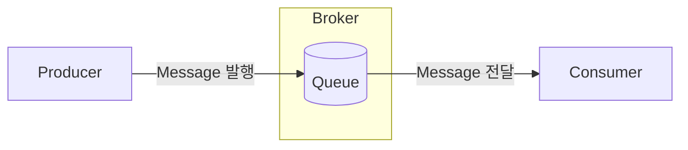
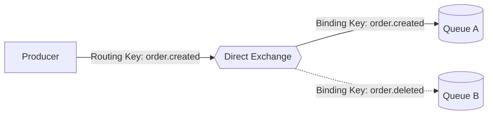
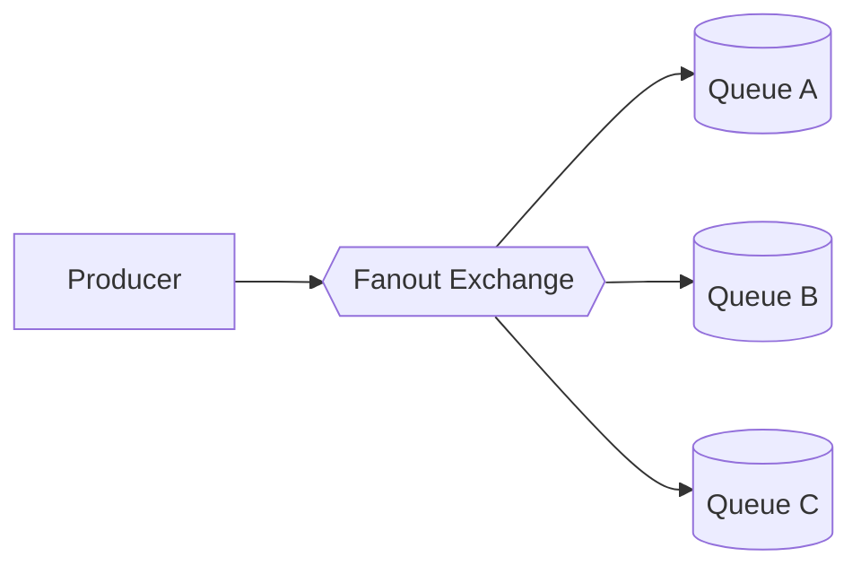
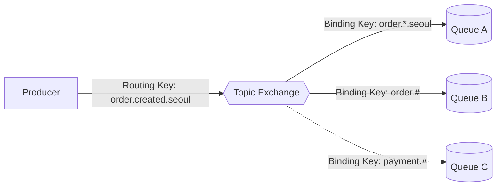
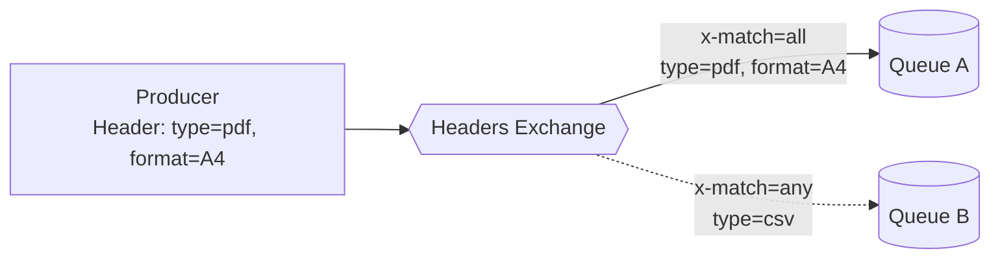

# Message Queue (메시지 큐)
**Message Queue (메시지 큐)**는 비동기로 서비스 간 정보를 주고받아 작업을 수행할 수 있게 해주는 통신 방식이다. 여기서의 **Queue (큐)**는 우리가 알고 있는 자료구조, 데이터들이 줄 서서 기다리고 있는 그 Queue와 같다.

이는 **Message-Oriented Middleware (메시지 지향 미들웨어)**라고 하는 개념을 실질적으로 구현한 것인데, 말 그대로 이는 메시지를 기반으로 독립적인 시스템을 연결하는 개념이라고 보면 된다.

## 왜 쓰게 될까?
최근에는 시스템의 규모가 커질수록 서로의 의존성을 줄여 각 필요한 영역마다 빠르게 개발할 수 있도록 MSA와 같은 분산 형태로 구축하는 경우가 많다.

물론 이 때 HTTP API와 같은 형태로 서로 통신하는 전통적인 방법도 있겠지만, 다음과 같은 문제가 생길 수 있다.
- Endpoint를 서비스마다 개별적으로 관리해야 하는 번거로움
- 일반 사용자와는 별도의 인증 방법을 구축해야 하는 번거로움
- 동기적으로 작동하여 한 쪽에 문제가 발생하면 이슈가 바로 전파되는 문제

하지만 **Message Queue** 통신 방식을 사용하면 Queue를 관리하는 **Broker (중개자)**를 통해 **Producer (생산자)**가 메시지를 보내고, 해당 정보를 처리해야 하는 **Consumer (소비자)**가 꺼내갈 수 있도록 하여 서로를 직접적으로 모르더라도 통신을 주고받을 수 있다.

실생활에서는 택배가 좋은 예시라고 할 수 있겠다.
- 제품 생산자 (Producer)는 택배를 받는 사람의 기본 정보와 물품을 택배 회사 (Broker)에 보내고,
- 택배 회사 (Broker)는 물건을 목적지별 보관함 (Queue)에 쌓아두며,
- 제품을 구매한 소비자 (Consumer)는 보관함 (Queue)에 내 앞으로 온 물건이 있다면 그 물건을 받을 수 있다.

## 구조
Message Queue는 아래와 같은 구성요소로 이뤄진다.

- **Producer (생산자)**: Publisher라고도 하며, Message를 만들어서 Broker에 발송하는 역할을 한다.
- **Consumer (소비자)**: Subscriber라고도 하며, Queue에 보관되어 있는 Message를 가져오거나, 혹은 받아서 정해진 작업을 수행하는 역할을 한다.
- **Broker (중개자)**: Message Queue를 관리하는 역할로서, Queue 자체 뿐만 아니라 메시지 수/발신, 저장, 라우팅 등 중앙에서 Producer와 Consumer를 이어주는 역할을 한다.
    - 일반적으로 Message Queue를 쓴다고 할 때, `RabbitMQ`, `Kafka`와 같은 종류들이 바로 이 **Broker**라고 보면 된다.



## Message 전달 패턴
Message Queue는 크게 **Point-to-Point Message Queue**와, **Pub-Sub Message Queue** 두 가지 전달 패턴이 있다.

### Point-to-Point Message Queue
Producer가 보낸 Message를 Consumer가 가져갈 때까지 Queue에 저장해두고, Message가 소비되면 Queue에서 제거되는 방식.
- 작업을 분산하기 위한 Queue, 부하 분산 (Load Balancing) 등이 대표적인 예시이다.

### Pub-Sub Message Queue
Producer가 보낸 Message를 구독한 모든 Consumer에게 전달하는 방식.
- 이벤트가 발생하면 작업을 수행하는 Event-driven Architecture가 대표적인 예시이다.

## Message Queue의 종류
Message Queue (정확히는 Broker)도 굉장히 다양한 종류가 존재한다.

- [RabbitMQ](https://www.rabbitmq.com/): AMQP 프로토콜 기반 Broker. Exchange를 통한 유연한 Routing(Direct/Fanout/Topic/Headers)을 지원하며, 메시지 순서 보장과 안정적인 전달에 강점이 있다.
- [Apache Kafka](https://kafka.apache.org/): 분산 스트리밍 플랫폼으로, RabbitMQ/ActiveMQ 같은 전통적인 MQ와는 결이 다르다. 다만 메시지를 중개한다는 점에서 Message Queue 용도로도 널리 쓰이고 있다. Topic을 Partition 단위로 나눠 병렬 처리하며, 메시지를 Log 형태로 디스크에 오래 보관해 대용량 실시간 처리에 적합하다.
- [AWS SQS (Simple Queue Service)](https://aws.amazon.com/ko/sqs/): AWS의 완전관리형 Queue 서비스. 별도 인프라 구축 없이 바로 사용 가능하며, Standard (높은 처리량)와 FIFO (순서 보장) 두 가지 Queue 타입을 제공한다.
- [Redis (Pub/Sub)](https://redis.io/docs/latest/develop/pubsub/): 인메모리 자료구조 저장소가 제공하는 Pub/Sub 기능. 매우 빠르지만 In-Memory 특성 상 다른 Queue 대비 메시지 유실 가능성이 높다.
- [ActiveMQ](https://activemq.apache.org/): Apache에서 관리하는 오픈소스 Broker. JMS(Java Message Service) 표준을 지원하며, AMQP/MQTT/STOMP 등 다양한 프로토콜과 호환된다.

위와 같은 다양한 Broker들이 많지만, 이번 글에서는 RabbitMQ를 기반으로 간단하게 Message Queue를 사용해보려고 한다.

# RabbitMQ 알아보기
**RabbitMQ**는 **AMQP (Advanced Message Queuing Protocol)**을 사용해 서비스 사이에서 메시지를 보내고 받는 방식으로 구현되어 있다.

## AMQP (Advanced Message Queuing Protocol)
**AMQP (Advanced Message Queuing Protocol)**은 메시지 지향 미들웨어를 위한 개방형 표준 프로토콜로, 특정 벤더에 종속되지 않아 RabbitMQ 외에도 여러 Broker가 이를 구현체로 사용한다.

RabbitMQ는 기본적으로 0.9.1 버전을 기반으로 하고 있어, 이 글은 0.9.1을 기준으로 작성했다. (플러그인을 통해 1.0을 쓰도록 설정할 수도 있다고 한다.)

1.0의 경우 ISO/IEC 표준으로도 제정되어 있으나, 0.9.1과 사실상 호환되지 않는다고 한다.

Wire-level (바이너리 레벨) 프로토콜이기 때문에 서로 다른 언어나 플랫폼으로 작성된 Producer, Consumer라도 동일한 방식으로 메시지를 주고받을 수 있다.

AMQP의 핵심은 Producer가 Queue에 메시지를 직접 넣지 않는다는 점이다. 대신 먼저 **Exchange**에 메시지를 발행하면, Exchange는 **Binding**에 설정된 **Routing Key** 규칙에 따라 메시지를 적절한 Queue로 분배한다.

## RabbitMQ의 구성요소
기본적으로 Message Queue 시스템이 갖춘 Broker, Producer, Consumer는 동일하게 존재하지만, AMQP를 따르기 때문에 몇 가지 추가 구성요소들이 존재한다.

### Exchange (교환기)
Broker가 수신받은 메시지를 어떤 Queue에 넣을지 결정하고, 해당하는 Queue에 보내는 역할을 한다.

아래와 같은 유형들이 존재한다.

- **Direct Exchange**: Message에 있는 Routing Key가 동일한 Binding Key를 가진 Queue에 보내는 방식.



- **Fanout Exchange**: 자신과 연결된 모든 Queue에 메시지를 보내는 방식. Routing Key는 무시된다.



- **Topic Exchange**: Binding Key에 *(word 1개), #(0개 이상 word) 같은 와일드카드를 사용해, Message의 Routing Key가 이 패턴과 매칭되면 해당 Queue로 전달하는 방식.



- **Headers Exchange**: Routing Key는 무시하고, Header의 key-value 쌍을 `x-match` 속성(all/any)으로 매칭해 해당하는 Queue에 Message를 보내는 방식.



### Binding (연결)
Queue와 Exchange 간의 연결을 의미하며, 이때 각 **Binding Key**를 통해 실제 Message가 어느 Queue로 가게 될지 정해진다.

### Routing Key
Message에 있는 속성으로서, 어느 Queue로 가게 될지 정해지는 중요한 요소이다.

이 Routing Key를 보고 **Exchange**가 적절한 Queue로 메시지를 보내준다.

## 직접 사용해보기

### RabbitMQ 서버 실행
우선 RabbitMQ를 빠르게 써보기 위해 Docker로 RabbitMQ를 띄워보자.

```shell
docker run -it --rm --name rabbitmq -p 5672:5672 -p 15672:15672 rabbitmq:4-management
```
- 5672번 포트는 AMQP 통신 포트
- 15672번 포트는 RabbitMQ Web Management Port이다.

`http://localhost:15672`로 접속하면 아래와 같이 Web Management 페이지로 들어갈 수 있다.


로그인 계정은 기본적으로 ID `guest` / PW `guest`이다.


### Spring Boot 종속성 설정
RabbitMQ 설치는 바로 완료되었으니, Spring Boot 프로젝트에 RabbitMQ를 사용할 수 있도록 Spring AMQP Starter를 종속성으로 추가해주겠다.

```groovy
    implementation 'org.springframework.boot:spring-boot-starter-amqp'
```

그리고 application.yml에 아래처럼 RabbitMQ 기본 접속 정보를 세팅해준다.

Local 머신에서 5672번 포트로 실행 중이니 아래처럼 작성해주었다.

```yaml
spring:
    ...
    rabbitmq:
        host: localhost
        port: 5672
        password: guest
        username: guest
```

### 기본 클래스 생성
우선 Queue와 Exchange, Binding Key를 설정해주자.

별도의 Config Class를 만들어서 아래처럼 세팅해주었다.

```java
package dev.aftermoon.rabbitmqexample;

import org.springframework.amqp.core.Binding;
import org.springframework.amqp.core.BindingBuilder;
import org.springframework.amqp.core.Queue;
import org.springframework.amqp.core.TopicExchange;
import org.springframework.amqp.rabbit.connection.ConnectionFactory;
import org.springframework.amqp.rabbit.listener.SimpleMessageListenerContainer;
import org.springframework.amqp.rabbit.listener.adapter.MessageListenerAdapter;
import org.springframework.context.annotation.Bean;
import org.springframework.context.annotation.Configuration;

@Configuration
public class MessagingQueueConfig {
    // Queue 이름
    static final String QUEUE_NAME = "example-queue";

    // Exchange 이름
    static final String EXCHANGE_NAME = "example-exchange";

    // Binding Key 이름 (Queue가 Exchange로부터 받을 메시지를 필터링하는 조건값)
    // Topic에서 *나 #을 쓰려면 명확하게 단어가 나눠지는 것을 인식할 수 있도록 . 단위로 끊어줘야 함
    static final String BINDING_KEY = "messaging.routing.key.*";

    @Bean
    public Queue messagingQueue() {
        // Queue 이름과 Durable 여부 (서버 재시작해도 큐가 살아있게 할 것인지) 설정
        return new Queue(QUEUE_NAME, true);
    }

    @Bean
    public TopicExchange messagingExchange() {
        // Exchange 설정
        // 여기서는 TopicExchange를 사용하고 있지만, 위에서 설명한 다른 Exchange도 사용 가능.
        return new TopicExchange(EXCHANGE_NAME);
    }

    @Bean
    public Binding messagingBinding() {
        // Queue와 Exchange를 특정 Key로 Binding (연결)
        return BindingBuilder.bind(messagingQueue()).to(messagingExchange()).with(BINDING_KEY);
    }

    @Bean
    public MessageListenerAdapter messageListenerAdapter(MessageReceiver messageReceiver) {
        // Message를 수신해서 처리할 Receiver 설정 - 여기서는 MessageReceiver라는 Class의 receiveMessage라는 메소드가 기본 처리하도록 함
        return new MessageListenerAdapter(messageReceiver, "receiveMessage");
    }

    @Bean
    public SimpleMessageListenerContainer messagingContainer(ConnectionFactory connectionFactory, MessageListenerAdapter listenerAdapter) {
        // Message Listener Container 설정
        SimpleMessageListenerContainer container = new SimpleMessageListenerContainer();

        // ConnectionFactory (yaml 입력을 통해 자동 생성된 RabbitMQ Connection)
        container.setConnectionFactory(connectionFactory);

        // Queue 이름
        container.setQueueNames(QUEUE_NAME);

        // Listener 설정
        container.setMessageListener(listenerAdapter);

        return container;
    }
}
```

위에서 사용한 `MessageReceiver`는 아래처럼 단순히 받은 메시지를 출력하게 했다.
```java
package dev.aftermoon.rabbitmqexample;

import lombok.Getter;
import org.springframework.stereotype.Component;

import java.util.concurrent.CountDownLatch;

@Component
public class MessageReceiver {
    @Getter
    private final CountDownLatch countDownLatch = new CountDownLatch(1);

    public void receiveMessage(String message) {
        System.out.println("Message received: " + message);
        countDownLatch.countDown();
    }
}
```

Consumer 쪽의 설정이 끝났으니 Producer 쪽도 만들어야 한다.

실제 개발 시에는 별도의 앱으로 나누겠지만, 지금은 테스트이므로 같은 앱 내에서 별도의 Runner를 만들어서 메시지를 보내게 했다.

```java
package dev.aftermoon.rabbitmqexample;

import lombok.RequiredArgsConstructor;
import org.springframework.amqp.rabbit.core.RabbitTemplate;
import org.springframework.boot.CommandLineRunner;
import org.springframework.stereotype.Component;

import java.util.concurrent.TimeUnit;

@Component
@RequiredArgsConstructor
public class MessageSendRunner implements CommandLineRunner {
    private final RabbitTemplate rabbitTemplate;
    private final MessageReceiver messageReceiver;

    @Override
    public void run(String... args) throws Exception {
        System.out.println("Send Message with RabbitMQ...");

        rabbitTemplate.convertAndSend(MessagingQueueConfig.EXCHANGE_NAME, "messaging.routing.key.1", "This is Message 1!");

        // Consumer가 비동기로 메시지를 처리할 시간을 벌어주기 위한 대기
        messageReceiver.getCountDownLatch().await(1, TimeUnit.SECONDS);
    }
}
```

위와 같이 세팅하고 실제 실행해보면 결과는 아래처럼 메시지를 잘 받는 것을 확인할 수 있다.

```
2026-08-15T23:49:20.855+09:00  INFO 52922 --- [rabbitmq-example] [           main] d.a.r.RabbitmqExampleApplication         : Starting RabbitmqExampleApplication using Java 25.0.2 with PID 52922 (/Users/user/develop/workspace/rabbitmq-example/build/classes/java/main started by user in /Users/user/develop/workspace/rabbitmq-example)
2026-08-15T23:49:20.856+09:00  INFO 52922 --- [rabbitmq-example] [           main] d.a.r.RabbitmqExampleApplication         : No active profile set, falling back to 1 default profile: "default"
2026-08-15T23:49:21.275+09:00  INFO 52922 --- [rabbitmq-example] [           main] o.s.boot.tomcat.TomcatWebServer          : Tomcat initialized with port 8080 (http)
2026-08-15T23:49:21.281+09:00  INFO 52922 --- [rabbitmq-example] [           main] o.apache.catalina.core.StandardService   : Starting service [Tomcat]
2026-08-15T23:49:21.281+09:00  INFO 52922 --- [rabbitmq-example] [           main] o.apache.catalina.core.StandardEngine    : Starting Servlet engine: [Apache Tomcat/11.0.22]
2026-08-15T23:49:21.299+09:00  INFO 52922 --- [rabbitmq-example] [           main] b.w.c.s.WebApplicationContextInitializer : Root WebApplicationContext: initialization completed in 427 ms
2026-08-15T23:49:21.602+09:00  INFO 52922 --- [rabbitmq-example] [           main] o.s.boot.tomcat.TomcatWebServer          : Tomcat started on port 8080 (http) with context path '/'
2026-08-15T23:49:21.603+09:00  INFO 52922 --- [rabbitmq-example] [           main] o.s.a.r.c.CachingConnectionFactory       : Attempting to connect to: [localhost:5672]
2026-08-15T23:49:21.626+09:00  INFO 52922 --- [rabbitmq-example] [           main] o.s.a.r.c.CachingConnectionFactory       : Created new connection: rabbitConnectionFactory#5eea5627:0/SimpleConnection@4fecf308 [delegate=amqp://guest@127.0.0.1:5672/, localPort=52774]
2026-08-15T23:49:21.653+09:00  INFO 52922 --- [rabbitmq-example] [           main] d.a.r.RabbitmqExampleApplication         : Started RabbitmqExampleApplication in 0.962 seconds (process running for 1.247)
Send Message with RabbitMQ...
Message received: This is Message 1!
```

RabbitMQ Management 쪽에서도 아래와 같이 정상적으로 위와 같이 반영된 걸 확인할 수 있었다.

- Connection


- Queue


- Exchange


# References
- [메시지 대기열이란 무엇입니까?](https://aws.amazon.com/ko/message-queue/)
- [Message Queues - System Design](https://www.geeksforgeeks.org/system-design/message-queues-system-design/)
- [Introduction to RabbitMQ](https://www.geeksforgeeks.org/blogs/introduction-to-rabbitmq/)
- [AMQP 0-9-1 Model Explained](https://www.rabbitmq.com/tutorials/amqp-concepts)
- [Messaging with RabbitMQ](https://spring.io/guides/gs/messaging-rabbitmq)